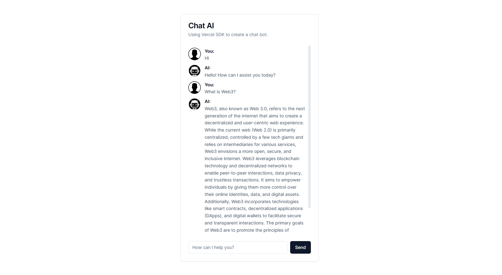

## Getting Started

First, create a file .env.local and insert your OPENAI API KEY:

```env
AI_KEY='your-openai-key'
```

Then, run the development server:

```bash
npm run dev
# or
yarn dev
# or
pnpm dev
```

Open [http://localhost:3000](http://localhost:3000) with your browser to see the result.


